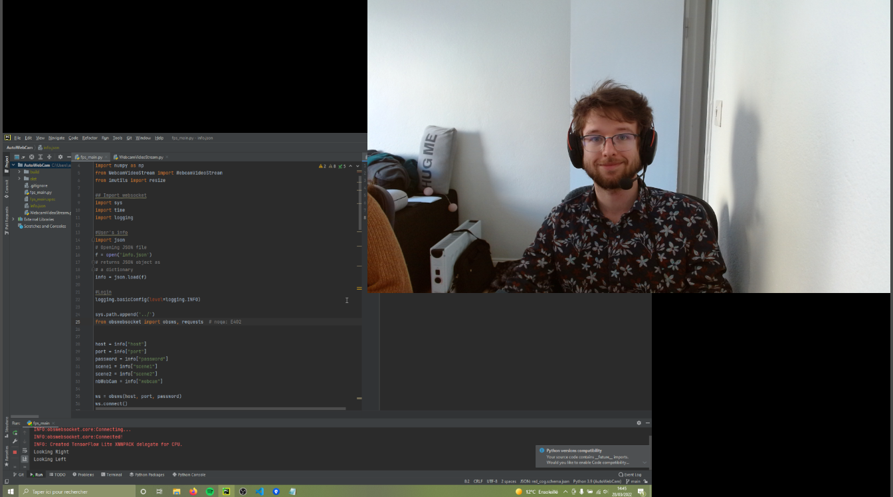

# CamSwitcher
A camera switcher written in Python with OpenCV and Mediapipe

CamSwitcher is a small python script that allows you to swap the scene you're using in OBS, depending on your head orientation.

It allows you to have video meeting where you're always looking in front!

A

Here's the flow :

* You have multiple scene set in OBS and multiple webcam, each webcam being in one OBS Scene.
* When you launch the python script, it will analyse the current OBS scene, thanks to the virtual cam plugin in OBS. 
* Depending on your head orientation in this scene, it'll change the current OBS scene.
* If set up properly (not that hard!), if you're looking on the right of your first webcam (that is the current scene), the script will automatically change the scene, making you be in front of your other camera.
* And then the other way around when looking left. 

## Python Dependencies

You need to install the following :
* OpenCV
* Mediapipe
* Imutils (We could do it ourselves but I'm lazy...)
* Numpy

## Installation 
1. Install OBS Studio 
2. Obs Websocket Plugin (https://obsproject.com/forum/resources/obs-websocket-remote-control-obs-studio-from-websockets.466/) 
3. Obs Virtual Cam plugin (https://obsproject.com/forum/resources/obs-virtualcam.949/)
4. Setup the websocket plugin with a port and a password
5. Setup the virtual cam so that it starts when starting OBS (just convenient, not necessary)
6. In OBS, setup the two scenes you want to swap between. Make sure that we can see your face on both of these scenes. See below for an example.
7. For the info.json, complete it with your password from the websocket, same for the port. You must use the exact same name for the Scenes.
8. **The left camera should be on scene 1 and the right camera on scene 2!**
9. For the webcam value, this is your virtual camera device number. To find it quickly, you can open Zoom for example and in the video tab, find the camera "Obs-Camera". The webcam number is its position -1. If it is the third option, then webcam must be set to 2.
10. Run OBS. You can run the script, you should see the scene change.
11. You can use the virtual camera in Zoom/teams or other since it is using an OBS Virtual Cam.

*A possible setup:*

## Bugfix 
None yet.
